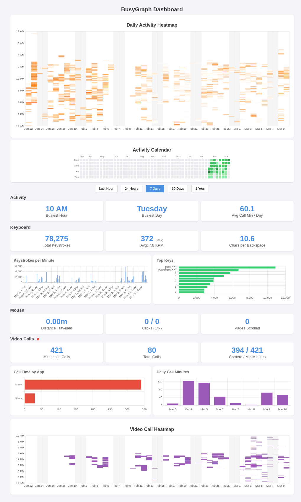

# BusyGraph

BusyGraph is a background application for macOS and Linux that tracks your keystrokes and mouse activity (distance, clicks, scrolls), aggregating them by minute. It exports these metrics via a built-in Prometheus exporter and provides a local dashboard for visualization.



## Features

-   **Keystroke Tracking**: Counts total keystrokes per minute.
-   **Mouse Tracking**: Tracks mouse distance (pixels), clicks (left/right), and scroll usage.
-   **Privacy-Focused**: Data is stored locally on your machine in a SQLite database.
-   **Dashboard**: Built-in web dashboard to view your activity stats over time (24h, 7d, 30d, 1y).
-   **Prometheus Metrics**: Exposes standard Prometheus metrics at `/metrics` for integration with your own monitoring stack (Grafana, etc.).
-   **System Tray**: Runs quietly in the background with a system tray icon for quick control.

## Installation

### Prerequisites

-   **Go**: 1.21 or later.
-   **Linux**: Requires X11 headers.
    ```bash
    sudo apt-get install libx11-dev libxtst-dev
    ```

### Building from Source

```bash
git clone https://github.com/victortrac/busygraph.git
cd busygraph
go build -o busygraph .
```

## Usage

Run the application:

```bash
./busygraph
```

Or run directly with Go:

```bash
go run .
```

On **macOS**, you will be prompted to grant "Accessibility" permissions on the first run. This is required to listen to global input events.

### Dashboard

Click "Open Dashboard" in the system tray menu, or navigate to:
[http://localhost:2112/dashboard](http://localhost:2112/dashboard)

### Metrics

Prometheus metrics are available at:
[http://localhost:2112/metrics](http://localhost:2112/metrics)

## Data Location

BusyGraph stores its data in a SQLite database located at:

-   **Linux/macOS**: `$XDG_DATA_HOME/busygraph/busygraph.db` (usually `~/.local/share/busygraph/busygraph.db`)

You can back up or migrate this file to preserve your history.

## Contributing

Pull requests are welcome. For major changes, please open an issue first to discuss what you would like to change.

## License

[MIT](LICENSE)
